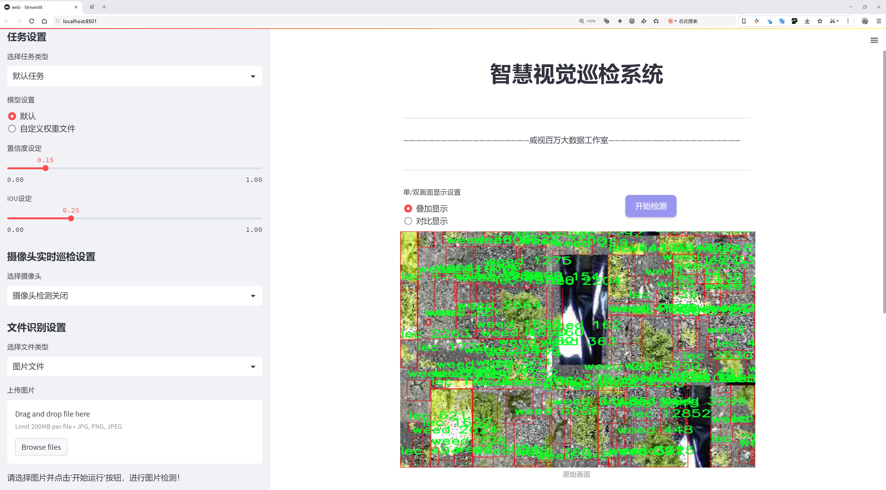
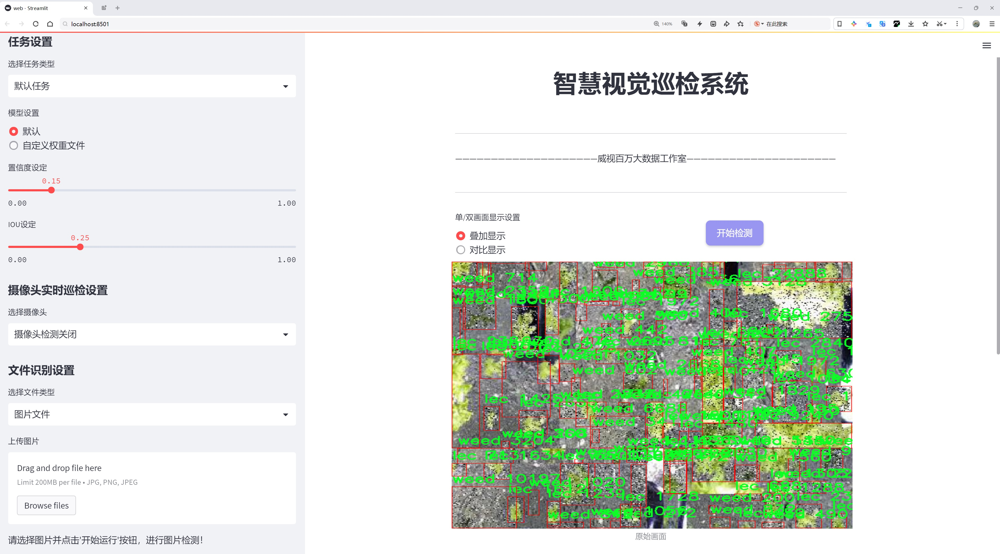
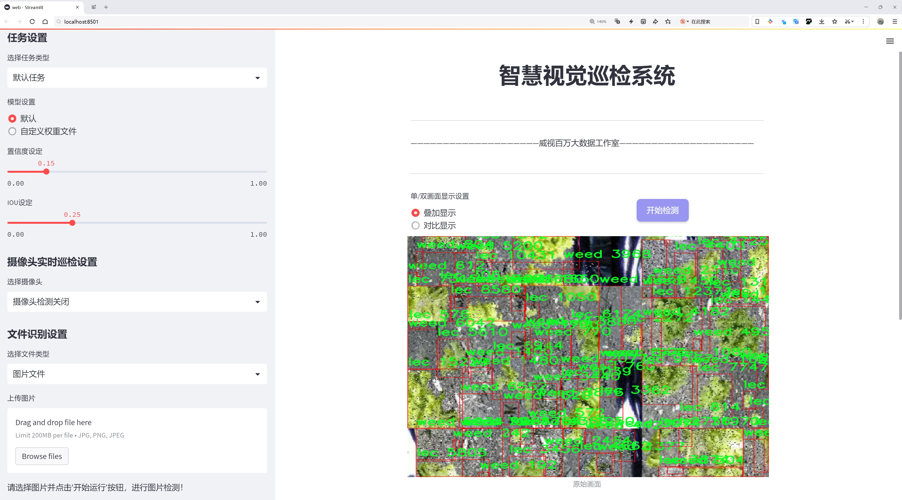
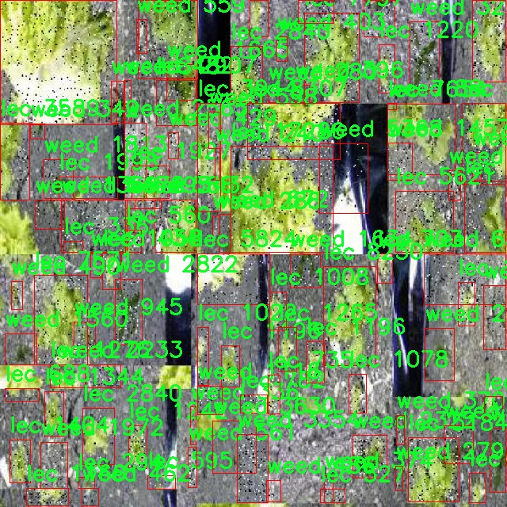
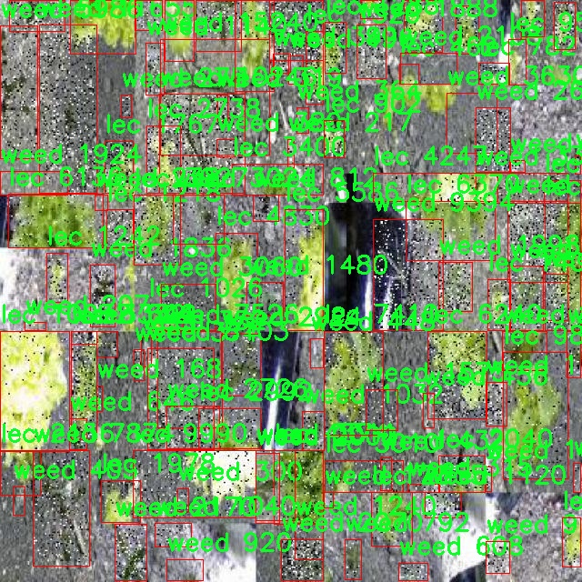
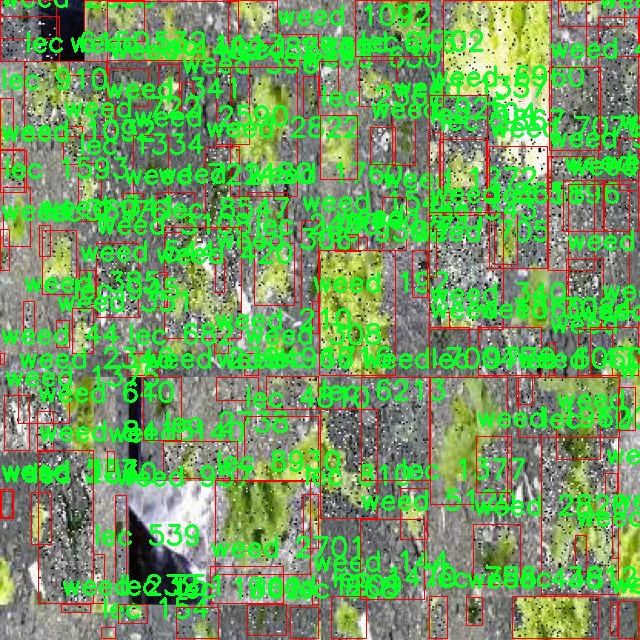
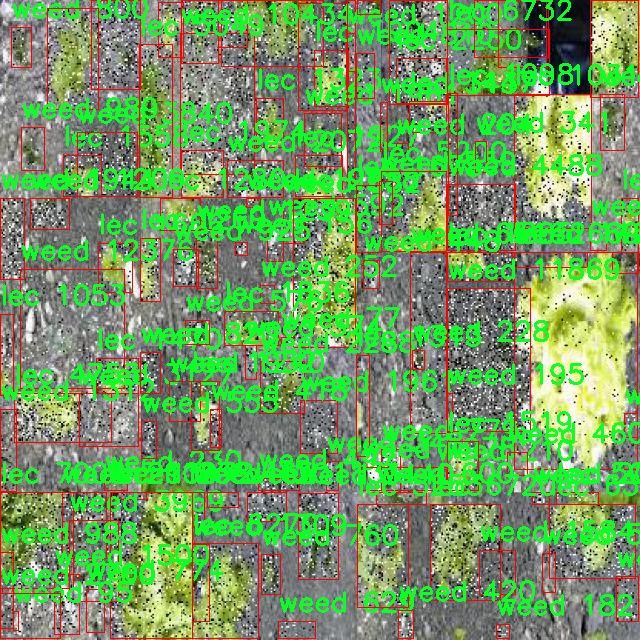
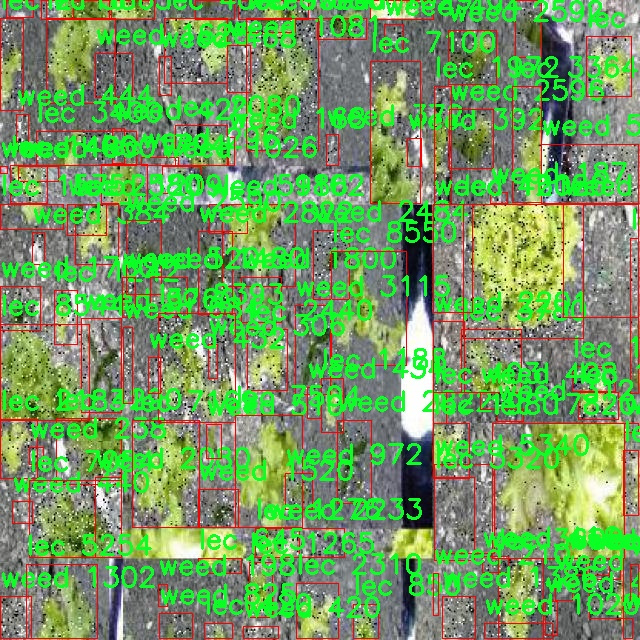

# 杂草检测检测系统源码分享
 # [一条龙教学YOLOV8标注好的数据集一键训练_70+全套改进创新点发刊_Web前端展示]

### 1.研究背景与意义

项目参考[AAAI Association for the Advancement of Artificial Intelligence](https://gitee.com/qunmasj/projects)

项目来源[AACV Association for the Advancement of Computer Vision](https://github.com/qunshansj/good)

研究背景与意义

随着全球农业生产的不断发展，杂草的管理与控制已成为提高作物产量和质量的重要环节。杂草不仅会与作物争夺水分、养分和光照，还可能成为病虫害的滋生地，进而影响农作物的生长和收成。因此，如何高效、准确地识别和管理杂草，已成为现代农业研究的重要课题。传统的杂草检测方法主要依赖人工观察和手动除草，这不仅费时费力，而且容易受到人为因素的影响，导致识别率低和误判现象频发。随着计算机视觉和深度学习技术的迅速发展，基于图像识别的自动化杂草检测系统逐渐成为研究的热点。

在众多的目标检测算法中，YOLO（You Only Look Once）系列模型因其高效性和实时性而受到广泛关注。YOLOv8作为该系列的最新版本，具备了更强的特征提取能力和更快的处理速度，能够在复杂的农业环境中实现对杂草的快速检测和分类。然而，尽管YOLOv8在目标检测领域表现出色，但在特定应用场景下，如杂草检测，仍然存在一些挑战。例如，杂草的种类繁多、形态各异，且与作物的外观相似度较高，这使得模型在识别时容易出现混淆。此外，现有的训练数据集往往样本数量不足，类别不平衡，导致模型的泛化能力受到限制。

为了解决上述问题，本研究旨在基于改进的YOLOv8模型，构建一个高效的杂草检测系统。我们将使用“collage_filter_30_originales Dataset 5”数据集，该数据集包含2427张图像，涵盖了两类目标：作物（lec）和杂草（weed）。通过对该数据集的深入分析与处理，我们将对YOLOv8模型进行改进，增强其在杂草检测中的性能。具体而言，我们将通过数据增强、迁移学习和模型优化等技术手段，提高模型对杂草的识别精度和鲁棒性。

本研究的意义在于，不仅能够为农业生产提供一种高效的杂草检测解决方案，还将推动计算机视觉技术在农业领域的应用与发展。通过实现自动化的杂草检测，农民可以在早期阶段及时识别和处理杂草，从而降低化学除草剂的使用，减少环境污染，提高作物的产量和质量。此外，本研究的成果还将为后续的农业智能化发展提供理论基础和技术支持，促进农业生产的可持续发展。

综上所述，基于改进YOLOv8的杂草检测系统的研究，不仅具有重要的理论价值，也具有广泛的实际应用前景。通过本研究，我们希望能够为农业生产提供更为智能化的解决方案，助力实现现代农业的高效、绿色和可持续发展。

### 2.图片演示







##### 注意：由于此博客编辑较早，上面“2.图片演示”和“3.视频演示”展示的系统图片或者视频可能为老版本，新版本在老版本的基础上升级如下：（实际效果以升级的新版本为准）

  （1）适配了YOLOV8的“目标检测”模型和“实例分割”模型，通过加载相应的权重（.pt）文件即可自适应加载模型。

  （2）支持“图片识别”、“视频识别”、“摄像头实时识别”三种识别模式。

  （3）支持“图片识别”、“视频识别”、“摄像头实时识别”三种识别结果保存导出，解决手动导出（容易卡顿出现爆内存）存在的问题，识别完自动保存结果并导出到tempDir中。

  （4）支持Web前端系统中的标题、背景图等自定义修改，后面提供修改教程。

  另外本项目提供训练的数据集和训练教程,暂不提供权重文件（best.pt）,需要您按照教程进行训练后实现图片演示和Web前端界面演示的效果。

### 3.视频演示

[3.1 视频演示](https://www.ixigua.com/7409515614982636073?utm_source=xiguastudio)

### 4.数据集信息展示

数据集信息展示

在现代农业中，杂草的检测与管理是提高作物产量和质量的重要环节。为了有效地训练改进YOLOv8的杂草检测系统，我们选用了名为“collage_filter_30_originales Dataset 5”的数据集。该数据集专门设计用于识别和分类杂草与作物之间的差异，提供了一个良好的基础，以支持深度学习模型在农业领域的应用。

“collage_filter_30_originales Dataset 5”数据集包含两类主要对象，分别是“lec”（作物）和“weed”（杂草）。这两类的划分不仅有助于模型的训练，也为后续的应用提供了清晰的目标。数据集中包含的样本数量丰富，涵盖了不同生长阶段、不同光照条件和不同背景下的作物与杂草图像，确保了模型能够在多样化的环境中进行有效的识别。

在数据集的构建过程中，特别注重了图像的多样性和代表性。每一类样本都经过精心挑选，确保其在形态、颜色和生长环境等方面的多样性。这种多样性使得模型在训练过程中能够学习到更为广泛的特征，从而提升其在实际应用中的泛化能力。例如，杂草的种类繁多，其形态和颜色与作物可能非常相似，因此在数据集中加入了不同种类的杂草图像，确保模型能够准确区分这两类对象。

此外，数据集还包含了标注信息，为每个图像提供了相应的类别标签。这些标签不仅有助于监督学习过程中的损失计算，也为后续的模型评估提供了依据。通过精确的标注，研究人员能够在训练后期对模型的性能进行详细分析，识别出模型在特定类别上的识别能力，进而进行针对性的优化。

为了进一步提高模型的鲁棒性，数据集在图像处理上也进行了多种增强操作。这包括随机裁剪、旋转、缩放以及亮度和对比度的调整等。这些增强操作不仅增加了数据集的有效样本数量，也使得模型在面对真实世界中的复杂情况时，能够保持较高的识别准确率。

在使用“collage_filter_30_originales Dataset 5”数据集进行YOLOv8模型的训练时，研究人员将采用交叉验证等方法，确保模型的性能在不同数据子集上的一致性。通过不断调整模型参数和优化算法，力求在提高检测精度的同时，降低误报率，最终实现高效、准确的杂草检测系统。

综上所述，“collage_filter_30_originales Dataset 5”数据集为改进YOLOv8的杂草检测系统提供了坚实的基础。其丰富的样本、多样的类别以及详尽的标注信息，使得该数据集在农业智能化管理领域的应用前景广阔。通过对该数据集的深入研究与应用，期望能够为农业生产提供更为智能化的解决方案，助力实现可持续发展的目标。











### 5.全套项目环境部署视频教程（零基础手把手教学）

[5.1 环境部署教程链接（零基础手把手教学）](https://www.ixigua.com/7404473917358506534?logTag=c807d0cbc21c0ef59de5)


[5.2 安装Python虚拟环境创建和依赖库安装视频教程链接（零基础手把手教学）](https://www.ixigua.com/7404474678003106304?logTag=1f1041108cd1f708b01a)

### 6.手把手YOLOV8训练视频教程（零基础小白有手就能学会）

[6.1 环境部署教程链接（零基础手把手教学）](https://www.ixigua.com/7404477157818401292?logTag=d31a2dfd1983c9668658)

### 7.70+种全套YOLOV8创新点代码加载调参视频教程（一键加载写好的改进模型的配置文件）

[7.1 环境部署教程链接（零基础手把手教学）](https://www.ixigua.com/7404478314661806627?logTag=29066f8288e3f4eea3a4)

### 8.70+种全套YOLOV8创新点原理讲解（非科班也可以轻松写刊发刊，V10版本正在科研待更新）

由于篇幅限制，每个创新点的具体原理讲解就不一一展开，具体见下列网址中的创新点对应子项目的技术原理博客网址【Blog】：


[8.1 70+种全套YOLOV8创新点原理讲解链接](https://gitee.com/qunmasj/good)

### 9.系统功能展示（检测对象为举例，实际内容以本项目数据集为准）

图9.1.系统支持检测结果表格显示

  图9.2.系统支持置信度和IOU阈值手动调节

  图9.3.系统支持自定义加载权重文件best.pt(需要你通过步骤5中训练获得)

  图9.4.系统支持摄像头实时识别

  图9.5.系统支持图片识别

  图9.6.系统支持视频识别

  图9.7.系统支持识别结果文件自动保存

  图9.8.系统支持Excel导出检测结果数据


### 10.原始YOLOV8算法原理

原始YOLOv8算法原理

YOLOv8算法是目标检测领域的一项重要进展，由Ultralytics公司于2023年1月10日发布，基于YOLOv7进行了深度优化和改进。作为YOLO系列算法的最新版本，YOLOv8不仅继承了前几代算法的优点，还在多个方面进行了创新，旨在提升目标检测的精度和速度。其核心思想是将整个图像作为输入，直接在图像上进行目标检测和定位，避免了传统方法中滑动窗口或区域提议的复杂性，从而实现了更高效的处理。

在数据预处理方面，YOLOv8延续了YOLOv5的策略，采用了多种增强手段，包括马赛克增强、混合增强、空间扰动和颜色扰动等。这些技术不仅丰富了训练数据集，还提高了模型的鲁棒性，使其能够在多种环境下表现出色。通过这些增强手段，YOLOv8能够有效地应对不同光照、角度和背景的变化，从而提升检测的准确性。

YOLOv8的骨干网络结构在YOLOv5的基础上进行了改进，采用了跨级结构（Cross Stage Partial, CSP）的设计理念。该算法用C2f模块替代了YOLOv5中的C3模块，C2f模块通过引入更多的分支，增强了特征的表达能力，并在梯度回传时提供了更丰富的信息流。这种设计不仅提高了特征提取的效率，还使得网络在训练过程中能够更好地捕捉到重要的特征信息。

在特征金字塔网络（FPN）和路径聚合网络（PAN）的结构设计上，YOLOv8依然采用了FPN-PAN的组合，以充分融合多尺度信息。尽管C3模块被替换为C2f模块，但YOLOv8在这一部分的设计思路与YOLOv5基本一致，确保了不同尺度特征之间的有效传递和融合。这种结构的优势在于，它能够在不同的尺度上提取特征，进而提高模型对小目标的检测能力。

YOLOv8在检测头的设计上也进行了创新，采用了解耦头结构。与之前的耦合结构不同，解耦头将分类和定位任务分为两个并行的分支，分别提取类别特征和位置特征。这种设计使得模型在处理任务时能够更加专注于每个特征的提取，从而提高了检测的精度和效率。通过使用1×1卷积分别完成分类和定位，YOLOv8能够在保持高帧率的同时，显著提升检测性能。

在标签分配策略方面，YOLOv8引入了动态标签分配策略，采用了与YOLOv6相同的TOOD策略。这一策略通过使用目标边界框和目标分数，动态地分配正负样本，从而解决了传统方法中候选框聚类依赖于数据集的问题。YOLOv8的损失函数主要包括类别损失和位置损失，其中类别损失采用了变焦损失（Varifocal Loss），而回归损失则结合了CIoU Loss和DFL Loss。这种损失函数的设计使得模型在训练过程中能够更加关注高质量的正样本，同时降低负样本对损失的影响，从而提升了整体的检测性能。

YOLOv8的整体架构通过多层次的特征提取和优化的损失函数，达到了在精度和速度上的双重提升。与YOLOv7相比，YOLOv8在mAP（mean Average Precision）和帧率上均有显著提高，分别提升了43.23%和10.28倍。这一进步使得YOLOv8在智能监控、自动驾驶、人脸识别等多种应用场景中展现出更强的竞争力。

综上所述，YOLOv8算法通过在数据预处理、骨干网络、特征金字塔、检测头和标签分配等多个方面的创新，形成了一种高效且准确的目标检测模型。其设计理念不仅继承了YOLO系列的优良传统，还在实际应用中展现出卓越的性能，为目标检测技术的发展提供了新的思路和方向。随着YOLOv8的广泛应用，未来在目标检测领域的研究和应用将迎来更多的可能性和挑战。


### 11.项目核心源码讲解（再也不用担心看不懂代码逻辑）

#### 11.1 ultralytics\utils\plotting.py

以下是经过精简和注释的核心代码部分，主要保留了 `Colors` 和 `Annotator` 类的实现。注释详细解释了每个方法的功能和参数。

```python
import numpy as np
from PIL import Image, ImageDraw, ImageFont

class Colors:
    """
    颜色类，用于处理颜色调色板，包括将十六进制颜色代码转换为RGB值。
    """

    def __init__(self):
        """初始化颜色调色板，使用Ultralytics默认的颜色。"""
        hexs = (
            "FF3838", "FF9D97", "FF701F", "FFB21D", "CFD231",
            "48F90A", "92CC17", "3DDB86", "1A9334", "00D4BB",
            "2C99A8", "00C2FF", "344593", "6473FF", "0018EC",
            "8438FF", "520085", "CB38FF", "FF95C8", "FF37C7",
        )
        # 将十六进制颜色转换为RGB
        self.palette = [self.hex2rgb(f"#{c}") for c in hexs]
        self.n = len(self.palette)  # 颜色数量
        # 预定义的姿态颜色调色板
        self.pose_palette = np.array(
            [
                [255, 128, 0], [255, 153, 51], [255, 178, 102],
                [230, 230, 0], [255, 153, 255], [153, 204, 255],
                [255, 102, 255], [255, 51, 255], [102, 178, 255],
                [51, 153, 255], [255, 153, 153], [255, 102, 102],
                [255, 51, 51], [153, 255, 153], [102, 255, 102],
                [51, 255, 51], [0, 255, 0], [0, 0, 255],
                [255, 0, 0], [255, 255, 255],
            ],
            dtype=np.uint8,
        )

    def __call__(self, i, bgr=False):
        """根据索引返回RGB颜色，支持BGR格式。"""
        c = self.palette[int(i) % self.n]
        return (c[2], c[1], c[0]) if bgr else c

    @staticmethod
    def hex2rgb(h):
        """将十六进制颜色代码转换为RGB值。"""
        return tuple(int(h[1 + i: 1 + i + 2], 16) for i in (0, 2, 4))


class Annotator:
    """
    注释类，用于在图像上绘制框、文本和关键点。
    """

    def __init__(self, im, line_width=None, font_size=None, font="Arial.ttf", pil=False):
        """初始化Annotator类，设置图像和绘制参数。"""
        self.im = im if isinstance(im, Image.Image) else Image.fromarray(im)  # 确保图像为PIL格式
        self.draw = ImageDraw.Draw(self.im)  # 创建绘图对象
        self.lw = line_width or 2  # 线宽
        self.font = ImageFont.load_default()  # 默认字体
        self.skeleton = [[16, 14], [14, 12], [17, 15], [15, 13]]  # 姿态骨架结构

    def box_label(self, box, label="", color=(128, 128, 128), txt_color=(255, 255, 255)):
        """在图像上绘制边框和标签。"""
        p1 = (box[0], box[1])  # 左上角坐标
        self.draw.rectangle(box, width=self.lw, outline=color)  # 绘制矩形框
        if label:
            w, h = self.draw.textsize(label, font=self.font)  # 获取文本大小
            self.draw.rectangle((p1[0], p1[1] - h, p1[0] + w + 1, p1[1] + 1), fill=color)  # 绘制标签背景
            self.draw.text((p1[0], p1[1] - h), label, fill=txt_color, font=self.font)  # 绘制标签文本

    def kpts(self, kpts, radius=5):
        """在图像上绘制关键点。"""
        for k in kpts:
            x, y = int(k[0]), int(k[1])
            self.draw.ellipse((x - radius, y - radius, x + radius, y + radius), fill=(0, 255, 0))  # 绘制关键点

    def result(self):
        """返回注释后的图像。"""
        return np.asarray(self.im)  # 将PIL图像转换为numpy数组
```

### 代码分析：
1. **Colors 类**：
   - 提供了一个颜色调色板，支持将十六进制颜色转换为RGB格式。
   - 通过 `__call__` 方法可以方便地获取颜色。

2. **Annotator 类**：
   - 用于在图像上绘制边框、文本和关键点。
   - `box_label` 方法用于绘制带标签的矩形框。
   - `kpts` 方法用于绘制关键点。

### 主要功能：
- 颜色管理和图像注释功能是YOLO模型后处理的重要组成部分，帮助可视化检测结果。

这个文件 `ultralytics/utils/plotting.py` 是一个用于图像处理和可视化的模块，主要与 Ultralytics YOLO（You Only Look Once）目标检测模型相关。该模块提供了一系列功能，包括颜色处理、图像注释、绘制边界框、绘制关键点、绘制掩膜、绘制统计图表等。

首先，文件中定义了一个 `Colors` 类，该类用于管理和转换颜色。它包含了一组预定义的颜色，支持将十六进制颜色代码转换为 RGB 值。该类的实例 `colors` 可以用于后续的颜色选择。

接下来，定义了一个 `Annotator` 类，用于在图像上添加注释和绘制元素。这个类可以处理 PIL 和 OpenCV 两种图像处理库。它的构造函数接受图像、线宽、字体等参数，并根据输入的图像类型选择合适的绘制方式。`Annotator` 类提供了多种方法，例如 `box_label` 用于绘制边界框和标签，`masks` 用于绘制掩膜，`kpts` 用于绘制关键点等。

在 `Annotator` 类中，`box_label` 方法允许用户在图像上绘制一个矩形框，并在框内添加标签。这个方法可以处理旋转的边界框，并根据输入的标签和颜色绘制相应的内容。`masks` 方法用于在图像上绘制掩膜，支持透明度设置。`kpts` 方法用于绘制关键点，并可以选择是否连接关键点以显示人体姿态。

此外，`plot_labels` 函数用于绘制训练标签，包括类直方图和边界框统计信息。它使用 pandas 和 seaborn 库来处理数据并生成可视化图表。该函数还会保存生成的图像到指定目录。

`save_one_box` 函数用于根据给定的边界框从图像中裁剪出一部分，并将其保存为图像文件。这个函数支持对裁剪区域进行放大和填充。

`plot_images` 函数用于绘制图像网格，并在每个图像上添加标签、边界框、关键点和掩膜。该函数会处理批量图像并生成一个包含所有图像的拼接图。

`plot_results` 函数用于从 CSV 文件中绘制训练结果，支持分割、姿态估计和分类等多种类型的数据。它会根据不同的标志绘制不同的图表，并保存结果。

最后，文件中还包含了一些辅助函数，例如 `plt_color_scatter` 用于绘制散点图，`plot_tune_results` 用于绘制超参数调优结果，`output_to_target` 和 `output_to_rotated_target` 用于将模型输出转换为可视化所需的格式，`feature_visualization` 用于可视化模型的特征图。

总的来说，这个文件提供了丰富的功能，支持在图像上进行各种注释和可视化操作，适用于目标检测和相关任务的结果展示。

#### 11.2 ui.py

```python
import sys
import subprocess

def run_script(script_path):
    """
    使用当前 Python 环境运行指定的脚本。

    Args:
        script_path (str): 要运行的脚本路径

    Returns:
        None
    """
    # 获取当前 Python 解释器的路径
    python_path = sys.executable

    # 构建运行命令，使用 streamlit 运行指定的脚本
    command = f'"{python_path}" -m streamlit run "{script_path}"'

    # 执行命令
    result = subprocess.run(command, shell=True)
    # 检查命令执行结果，如果返回码不为0，则表示执行出错
    if result.returncode != 0:
        print("脚本运行出错。")

# 实例化并运行应用
if __name__ == "__main__":
    # 指定要运行的脚本路径
    script_path = "web.py"  # 这里可以直接指定脚本名称

    # 运行脚本
    run_script(script_path)
```

### 代码注释说明：
1. **导入模块**：
   - `sys`：用于获取当前 Python 解释器的路径。
   - `subprocess`：用于执行外部命令。

2. **`run_script` 函数**：
   - 该函数接受一个参数 `script_path`，表示要运行的 Python 脚本的路径。
   - 使用 `sys.executable` 获取当前 Python 解释器的路径，以确保使用相同的环境来运行脚本。
   - 构建命令字符串，使用 `streamlit` 模块运行指定的脚本。
   - 使用 `subprocess.run` 执行构建的命令，并通过 `shell=True` 允许在 shell 中执行。
   - 检查命令的返回码，如果不为0，表示执行过程中出现错误，打印错误信息。

3. **主程序块**：
   - 当脚本作为主程序运行时，指定要运行的脚本路径（在这里是 `web.py`）。
   - 调用 `run_script` 函数来执行指定的脚本。

这个程序文件名为 `ui.py`，其主要功能是使用当前的 Python 环境来运行一个指定的脚本。程序首先导入了必要的模块，包括 `sys`、`os` 和 `subprocess`，以及一个自定义的路径处理模块 `abs_path`。

在 `run_script` 函数中，首先获取当前 Python 解释器的路径，这通过 `sys.executable` 实现。接着，构建一个命令字符串，该命令用于运行指定的脚本，这里使用了 `streamlit` 这个库来启动一个 Web 应用。命令的格式是 `python -m streamlit run script_path`，其中 `script_path` 是传入的参数。

随后，使用 `subprocess.run` 方法来执行这个命令。这个方法会在一个新的 shell 中运行命令，并等待其完成。如果脚本运行过程中出现错误，返回的 `returncode` 将不为零，程序会打印出“脚本运行出错”的提示信息。

在文件的最后部分，使用 `if __name__ == "__main__":` 语句来确保只有在直接运行该脚本时才会执行后面的代码。在这里，指定了要运行的脚本路径为 `web.py`，并调用 `run_script` 函数来执行这个脚本。

总体来看，这个程序的主要目的是提供一个简单的接口，通过命令行运行一个名为 `web.py` 的 Streamlit 应用。

#### 11.3 ultralytics\models\yolo\pose\predict.py

以下是经过简化和注释的核心代码部分：

```python
# 导入必要的模块和类
from ultralytics.engine.results import Results
from ultralytics.models.yolo.detect.predict import DetectionPredictor
from ultralytics.utils import DEFAULT_CFG, LOGGER, ops

class PosePredictor(DetectionPredictor):
    """
    PosePredictor类用于基于姿态模型进行预测，继承自DetectionPredictor类。
    """

    def __init__(self, cfg=DEFAULT_CFG, overrides=None, _callbacks=None):
        """初始化PosePredictor，设置任务为'pose'并记录使用'mps'作为设备的警告。"""
        super().__init__(cfg, overrides, _callbacks)  # 调用父类构造函数
        self.args.task = "pose"  # 设置任务为姿态检测
        # 检查设备是否为Apple MPS，如果是则发出警告
        if isinstance(self.args.device, str) and self.args.device.lower() == "mps":
            LOGGER.warning(
                "WARNING ⚠️ Apple MPS known Pose bug. Recommend 'device=cpu' for Pose models. "
                "See https://github.com/ultralytics/ultralytics/issues/4031."
            )

    def postprocess(self, preds, img, orig_imgs):
        """对给定输入图像或图像列表返回检测结果。"""
        # 使用非极大值抑制处理预测结果
        preds = ops.non_max_suppression(
            preds,
            self.args.conf,  # 置信度阈值
            self.args.iou,  # IOU阈值
            agnostic=self.args.agnostic_nms,  # 是否使用类别无关的NMS
            max_det=self.args.max_det,  # 最大检测数量
            classes=self.args.classes,  # 选择的类别
            nc=len(self.model.names),  # 类别数量
        )

        # 如果输入图像不是列表，则将其转换为numpy数组
        if not isinstance(orig_imgs, list):
            orig_imgs = ops.convert_torch2numpy_batch(orig_imgs)

        results = []  # 存储结果的列表
        for i, pred in enumerate(preds):
            orig_img = orig_imgs[i]  # 获取原始图像
            # 调整预测框的坐标到原始图像的大小
            pred[:, :4] = ops.scale_boxes(img.shape[2:], pred[:, :4], orig_img.shape).round()
            # 获取关键点预测
            pred_kpts = pred[:, 6:].view(len(pred), *self.model.kpt_shape) if len(pred) else pred[:, 6:]
            # 调整关键点坐标到原始图像的大小
            pred_kpts = ops.scale_coords(img.shape[2:], pred_kpts, orig_img.shape)
            img_path = self.batch[0][i]  # 获取图像路径
            # 将结果存储到results列表中
            results.append(
                Results(orig_img, path=img_path, names=self.model.names, boxes=pred[:, :6], keypoints=pred_kpts)
            )
        return results  # 返回检测结果
```

### 代码注释说明：
1. **导入模块**：导入必要的类和函数，以便在PosePredictor类中使用。
2. **PosePredictor类**：该类用于姿态检测，继承自DetectionPredictor类，增加了姿态特定的功能。
3. **构造函数**：初始化PosePredictor，设置任务为姿态检测，并检查设备类型，发出警告。
4. **后处理函数**：对模型的预测结果进行后处理，包括非极大值抑制、坐标缩放和结果整理。返回包含检测结果的列表。

这个程序文件是一个用于姿态预测的类，名为 `PosePredictor`，它继承自 `DetectionPredictor` 类。该类的主要功能是基于姿态模型进行预测，并处理输入图像的结果。

在文件的开头，首先导入了一些必要的模块和类，包括 `Results`、`DetectionPredictor` 和一些工具函数。接着，定义了 `PosePredictor` 类，并在类的文档字符串中给出了使用示例，说明如何使用这个类进行姿态预测。

在 `__init__` 方法中，初始化了 `PosePredictor` 类，设置任务为 "pose"。同时，如果设备被设置为 "mps"（即 Apple 的 Metal Performance Shaders），则会发出警告，提示用户在使用姿态模型时推荐使用 "cpu" 设备。这是因为在使用 "mps" 时可能会遇到已知的 bug。

`postprocess` 方法是该类的核心功能之一，它负责处理模型的预测结果。首先，它使用非极大值抑制（NMS）来过滤掉低置信度的检测结果。然后，如果输入的原始图像不是列表形式，便将其转换为 NumPy 数组。接下来，遍历每个预测结果，调整边界框的坐标以适应原始图像的尺寸，并将关键点的坐标进行相应的缩放。最后，将处理后的结果封装成 `Results` 对象，并返回这些结果。

总体来说，这个文件实现了一个用于姿态估计的预测器，能够处理输入图像并返回相应的检测结果，包括边界框和关键点信息。

#### 11.4 ultralytics\models\fastsam\predict.py

以下是经过简化和注释的核心代码部分：

```python
import torch
from ultralytics.engine.results import Results
from ultralytics.models.fastsam.utils import bbox_iou
from ultralytics.models.yolo.detect.predict import DetectionPredictor
from ultralytics.utils import ops

class FastSAMPredictor(DetectionPredictor):
    """
    FastSAMPredictor类专门用于在Ultralytics YOLO框架中进行快速SAM（Segment Anything Model）分割预测任务。
    该类继承自DetectionPredictor，定制了快速SAM的预测流程，调整了后处理步骤以结合掩码预测和非最大抑制，
    同时优化单类分割。
    """

    def __init__(self, cfg=DEFAULT_CFG, overrides=None, _callbacks=None):
        """
        初始化FastSAMPredictor类，设置任务为'分割'。
        
        参数:
            cfg (dict): 预测的配置参数。
            overrides (dict, optional): 可选的参数覆盖，用于自定义行为。
            _callbacks (dict, optional): 可选的回调函数列表，在预测过程中调用。
        """
        super().__init__(cfg, overrides, _callbacks)
        self.args.task = "segment"  # 设置任务为分割

    def postprocess(self, preds, img, orig_imgs):
        """
        对预测结果进行后处理，包括非最大抑制和将框缩放到原始图像大小，并返回最终结果。
        
        参数:
            preds (list): 模型的原始输出预测。
            img (torch.Tensor): 处理后的图像张量。
            orig_imgs (list | torch.Tensor): 原始图像或图像列表。
        
        返回:
            (list): 包含处理后的框、掩码和其他元数据的Results对象列表。
        """
        # 应用非最大抑制，过滤掉低置信度的预测
        p = ops.non_max_suppression(
            preds[0],
            self.args.conf,
            self.args.iou,
            agnostic=self.args.agnostic_nms,
            max_det=self.args.max_det,
            nc=1,  # SAM没有类别预测，因此设置为1类
            classes=self.args.classes,
        )

        # 创建一个全框，初始化为图像的大小
        full_box = torch.zeros(p[0].shape[1], device=p[0].device)
        full_box[2], full_box[3], full_box[4], full_box[6:] = img.shape[3], img.shape[2], 1.0, 1.0
        full_box = full_box.view(1, -1)

        # 计算与全框的IoU，并根据阈值更新full_box
        critical_iou_index = bbox_iou(full_box[0][:4], p[0][:, :4], iou_thres=0.9, image_shape=img.shape[2:])
        if critical_iou_index.numel() != 0:
            full_box[0][4] = p[0][critical_iou_index][:, 4]
            full_box[0][6:] = p[0][critical_iou_index][:, 6:]
            p[0][critical_iou_index] = full_box

        # 如果输入图像是张量而不是列表，则转换为numpy数组
        if not isinstance(orig_imgs, list):
            orig_imgs = ops.convert_torch2numpy_batch(orig_imgs)

        results = []
        proto = preds[1][-1] if len(preds[1]) == 3 else preds[1]  # 获取掩码预测的原型

        # 遍历每个预测结果
        for i, pred in enumerate(p):
            orig_img = orig_imgs[i]  # 获取原始图像
            img_path = self.batch[0][i]  # 获取图像路径
            
            if not len(pred):  # 如果没有预测框
                masks = None
            elif self.args.retina_masks:  # 如果使用Retina掩码
                pred[:, :4] = ops.scale_boxes(img.shape[2:], pred[:, :4], orig_img.shape)  # 缩放框
                masks = ops.process_mask_native(proto[i], pred[:, 6:], pred[:, :4], orig_img.shape[:2])  # 处理掩码
            else:  # 使用常规掩码处理
                masks = ops.process_mask(proto[i], pred[:, 6:], pred[:, :4], img.shape[2:], upsample=True)  # 处理掩码
                pred[:, :4] = ops.scale_boxes(img.shape[2:], pred[:, :4], orig_img.shape)  # 缩放框
            
            # 将结果存储到results列表中
            results.append(Results(orig_img, path=img_path, names=self.model.names, boxes=pred[:, :6], masks=masks))
        
        return results  # 返回处理后的结果列表
```

### 代码说明：
1. **FastSAMPredictor类**：继承自`DetectionPredictor`，用于快速SAM分割预测。
2. **__init__方法**：初始化预测器，设置任务为分割。
3. **postprocess方法**：对模型的原始预测结果进行后处理，包括非最大抑制、框的缩放和掩码的处理，最终返回包含处理结果的列表。

该程序文件 `ultralytics\models\fastsam\predict.py` 定义了一个名为 `FastSAMPredictor` 的类，该类专门用于在 Ultralytics YOLO 框架中进行快速的 SAM（Segment Anything Model）分割预测任务。这个类继承自 `DetectionPredictor`，并对预测流程进行了定制，以便更好地支持快速的分割任务。

在类的初始化方法 `__init__` 中，调用了父类的构造函数，并将任务类型设置为“segment”，这表明该预测器的主要功能是进行图像分割。构造函数接受三个参数：配置参数 `cfg`，可选的参数覆盖 `overrides`，以及可选的回调函数 `_callbacks`。

`postprocess` 方法是该类的核心功能之一，负责对模型的原始输出进行后处理，包括非极大值抑制（NMS）和将边界框缩放到原始图像大小。该方法接收三个参数：`preds` 是模型的原始输出，`img` 是处理后的图像张量，`orig_imgs` 是原始图像或图像列表。该方法的返回值是一个包含处理后结果的列表，每个结果对象包含了处理后的边界框、掩膜和其他元数据。

在 `postprocess` 方法中，首先对模型的预测结果进行非极大值抑制，以去除冗余的检测框。接着，创建一个全零的张量 `full_box`，并根据输入图像的形状进行初始化。然后，通过计算边界框的 IOU（Intersection over Union）来确定哪些预测框是关键的，并更新 `full_box` 的相关信息。

接下来，检查输入的原始图像是否为列表，如果不是，则将其转换为 NumPy 格式。然后，处理每个预测结果，如果没有检测到目标，则掩膜设置为 `None`；如果启用了 `retina_masks`，则使用原生方法处理掩膜；否则，使用常规方法处理掩膜，并将边界框缩放到原始图像的大小。最后，将每个结果封装为 `Results` 对象，并返回结果列表。

总的来说，该文件实现了一个高效的分割预测器，能够处理图像分割任务中的各种细节，确保输出结果的准确性和有效性。

#### 11.5 train.py

以下是代码中最核心的部分，并附上详细的中文注释：

```python
import os
import torch
import yaml
from ultralytics import YOLO  # 导入YOLO模型
from QtFusion.path import abs_path  # 导入获取绝对路径的函数

# 设置设备为GPU（如果可用），否则使用CPU
device = "0" if torch.cuda.is_available() else "cpu"

if __name__ == '__main__':  # 确保该模块被直接运行时才执行以下代码
    workers = 1  # 设置数据加载的工作进程数
    batch = 2  # 设置每个批次的大小

    data_name = "data"  # 数据集名称
    # 获取数据集yaml文件的绝对路径
    data_path = abs_path(f'datasets/{data_name}/{data_name}.yaml', path_type='current')  
    unix_style_path = data_path.replace(os.sep, '/')  # 将路径转换为Unix风格

    # 获取目录路径
    directory_path = os.path.dirname(unix_style_path)
    
    # 读取YAML文件，保持原有顺序
    with open(data_path, 'r') as file:
        data = yaml.load(file, Loader=yaml.FullLoader)
    
    # 修改YAML文件中的'path'项为数据集目录路径
    if 'path' in data:
        data['path'] = directory_path
        # 将修改后的数据写回YAML文件
        with open(data_path, 'w') as file:
            yaml.safe_dump(data, file, sort_keys=False)

    # 加载预训练的YOLOv8模型
    model = YOLO(model='./ultralytics/cfg/models/v8/yolov8s.yaml', task='detect')  
    
    # 开始训练模型
    results2 = model.train(  
        data=data_path,  # 指定训练数据的配置文件路径
        device=device,  # 指定使用的设备（GPU或CPU）
        workers=workers,  # 指定使用的工作进程数
        imgsz=640,  # 指定输入图像的大小为640x640
        epochs=100,  # 指定训练的轮数为100
        batch=batch,  # 指定每个批次的大小
        name='train_v8_' + data_name  # 指定训练任务的名称
    )
```

### 代码说明：
1. **导入必要的库**：导入了操作系统相关的库、PyTorch库、YAML解析库以及YOLO模型库。
2. **设备选择**：根据是否有可用的GPU，选择训练设备为GPU或CPU。
3. **主程序入口**：使用`if __name__ == '__main__':`确保代码块只在直接运行该脚本时执行。
4. **数据集配置**：指定数据集名称并构建其YAML配置文件的绝对路径，读取并修改其中的路径信息。
5. **模型加载**：加载YOLOv8模型的配置文件。
6. **模型训练**：调用`model.train()`方法开始训练，传入数据路径、设备、工作进程数、图像大小、训练轮数、批次大小和训练任务名称等参数。

这个程序文件`train.py`主要用于训练YOLOv8目标检测模型。首先，程序导入了必要的库，包括`os`、`torch`、`yaml`和`ultralytics`中的YOLO模型。根据系统是否支持CUDA，程序会选择使用GPU（设备编号为"0"）或CPU进行训练。

在`__main__`模块中，程序首先设置了一些训练参数，包括工作进程数`workers`和批次大小`batch`。接着，程序定义了数据集的名称`data_name`，并构建了数据集配置文件的绝对路径。这个路径是通过调用`abs_path`函数获取的，函数的参数是数据集所在的目录和YAML文件名。

程序读取指定路径下的YAML文件，使用`yaml`库保持原有的顺序。读取后，程序检查YAML文件中是否包含`path`项，如果有，则将其修改为数据集的目录路径，并将更新后的内容写回到YAML文件中。

接下来，程序加载YOLOv8模型，指定了模型的配置文件路径和任务类型为目标检测。然后，调用`model.train`方法开始训练模型。在训练过程中，程序指定了训练数据的配置文件路径、设备、工作进程数、输入图像的大小（640x640）、训练的轮数（100个epoch）以及训练任务的名称。

总的来说，这个程序实现了YOLOv8模型的训练流程，包括数据集路径的处理、模型的加载和训练参数的设置。

#### 11.6 ultralytics\engine\exporter.py

以下是经过简化和注释的代码，保留了核心部分：

```python
import json
import os
import shutil
import subprocess
import time
import warnings
from copy import deepcopy
from datetime import datetime
from pathlib import Path
import torch
from ultralytics.cfg import get_cfg
from ultralytics.utils import (
    LOGGER,
    get_default_args,
    yaml_save,
)

class Exporter:
    """
    导出模型的类。

    属性:
        args (SimpleNamespace): 导出器的配置。
        callbacks (list, optional): 回调函数列表。默认为 None。
    """

    def __init__(self, cfg='default_cfg.yaml', overrides=None, _callbacks=None):
        """
        初始化 Exporter 类。

        参数:
            cfg (str, optional): 配置文件的路径。默认为 'default_cfg.yaml'。
            overrides (dict, optional): 配置覆盖。默认为 None。
            _callbacks (dict, optional): 回调函数字典。默认为 None。
        """
        self.args = get_cfg(cfg, overrides)  # 获取配置
        self.callbacks = _callbacks or []  # 初始化回调

    def __call__(self, model=None):
        """运行导出过程并返回导出的文件/目录列表。"""
        self.run_callbacks("on_export_start")  # 运行开始导出的回调
        t = time.time()  # 记录开始时间

        # 检查模型是否有类名
        if not hasattr(model, "names"):
            model.names = ["default"]  # 默认类名

        # 设置输入图像
        im = torch.zeros(self.args.batch, 3, *self.args.imgsz).to("cpu")  # 创建输入张量

        # 更新模型
        model = deepcopy(model).to("cpu")  # 深拷贝模型并移动到 CPU
        model.eval()  # 设置为评估模式

        # 执行干运行以检查模型
        for _ in range(2):
            model(im)  # 进行两次前向传播

        # 导出模型
        f = self.export_onnx(model, im)  # 导出为 ONNX 格式

        # 完成导出
        self.run_callbacks("on_export_end")  # 运行结束导出的回调
        return f  # 返回导出的文件名

    def export_onnx(self, model, im):
        """导出为 ONNX 格式的函数。"""
        f = "model.onnx"  # 输出文件名
        torch.onnx.export(
            model.cpu(),  # 将模型移动到 CPU
            im.cpu(),  # 将输入移动到 CPU
            f,  # 输出文件名
            input_names=["images"],  # 输入名称
            output_names=["output0"],  # 输出名称
        )
        return f  # 返回导出的文件名

    def run_callbacks(self, event: str):
        """执行给定事件的所有回调。"""
        for callback in self.callbacks.get(event, []):
            callback(self)  # 调用每个回调

# 使用示例
# exporter = Exporter()
# exported_file = exporter(model)
```

### 代码说明：
1. **类 `Exporter`**：负责导出模型的主要逻辑。
   - **初始化方法 `__init__`**：加载配置并初始化回调。
   - **方法 `__call__`**：执行导出过程，首先运行开始导出的回调，然后进行模型的干运行，最后调用导出方法并返回导出的文件名。
   - **方法 `export_onnx`**：将模型导出为 ONNX 格式，使用 `torch.onnx.export` 函数。
   - **方法 `run_callbacks`**：用于执行与导出过程相关的回调函数。

2. **输入和输出**：输入是一个随机生成的张量，输出是导出的 ONNX 文件名。

3. **回调机制**：允许在导出过程的不同阶段插入自定义逻辑。

这个程序文件`exporter.py`是Ultralytics YOLOv8模型的导出模块，主要用于将训练好的YOLOv8模型导出为多种格式，以便在不同的框架和平台上进行推理。文件中详细列出了支持的导出格式，包括PyTorch、ONNX、TensorFlow等，并提供了相应的导出方法。

文件的开头部分包含了对不同导出格式的描述，列出了每种格式的命令行参数和生成的模型文件名。支持的格式包括PyTorch、TorchScript、ONNX、OpenVINO、TensorRT、CoreML、TensorFlow SavedModel、TensorFlow Lite、TensorFlow Edge TPU、TensorFlow.js、PaddlePaddle和ncnn等。用户可以通过Python代码或命令行接口（CLI）调用这些导出功能。

接下来的部分导入了所需的库和模块，包括处理文件路径、时间、警告、深度学习框架PyTorch等。文件中定义了一些辅助函数，如`export_formats`用于返回支持的导出格式，`gd_outputs`用于获取TensorFlow GraphDef模型的输出节点名称，`try_export`是一个装饰器，用于捕获导出过程中的异常并记录日志。

`Exporter`类是该模块的核心，负责模型的导出。它的构造函数接收配置文件路径和覆盖参数，并初始化导出所需的参数和回调函数。`__call__`方法是导出模型的主要逻辑，首先运行导出开始的回调，然后根据用户指定的格式进行相应的导出操作。它会检查模型的名称、设备、图像大小等参数，并进行必要的预处理。

在导出过程中，程序会调用不同的导出方法，如`export_torchscript`、`export_onnx`、`export_openvino`等，每个方法负责将模型导出为特定格式。每个导出方法都使用`try_export`装饰器，以确保在导出过程中发生的任何异常都能被捕获并记录。

此外，程序还提供了一些特定格式的导出实现，例如TensorRT的导出需要在GPU上运行，而CoreML的导出仅支持在macOS或Linux上进行。对于每种格式，程序会根据需要进行优化、量化等处理，并生成相应的元数据。

最后，程序中还定义了一些辅助类和方法，如`IOSDetectModel`，用于在导出到CoreML时对YOLO模型进行封装和处理。整个模块通过丰富的日志记录和错误处理机制，确保用户能够顺利地将YOLOv8模型导出为所需的格式。

### 12.系统整体结构（节选）

### 整体功能和构架概括

该项目是一个基于Ultralytics YOLO框架的目标检测和姿态估计系统，提供了多种功能模块以支持模型的训练、预测、可视化和导出。项目的结构清晰，主要分为以下几个部分：

1. **模型训练**：通过`train.py`文件，用户可以配置和启动YOLOv8模型的训练过程，指定数据集、训练参数等。

2. **预测功能**：包括姿态预测（`ultralytics/models/yolo/pose/predict.py`）和快速分割预测（`ultralytics/models/fastsam/predict.py`），这些模块实现了对输入图像的推理，并返回检测结果。

3. **可视化工具**：`ultralytics/utils/plotting.py`提供了丰富的可视化功能，用于绘制训练结果、边界框、关键点等，帮助用户更好地理解模型的性能。

4. **用户界面**：`ui.py`文件提供了一个简单的用户界面，用于运行特定的脚本（如Web应用），使得用户可以更方便地与模型进行交互。

5. **模型导出**：`ultralytics/engine/exporter.py`模块负责将训练好的模型导出为多种格式，以便在不同的环境中进行推理。

6. **超参数调优**：`ultralytics/engine/tuner.py`模块支持超参数的调优，帮助用户优化模型性能。

7. **回调功能**：`ultralytics/utils/callbacks/wb.py`和`ultralytics/utils/callbacks/raytune.py`提供了用于训练过程中的回调机制，支持与Weights & Biases和Ray Tune等工具的集成。

### 文件功能整理表

| 文件路径                                      | 功能描述                                                   |
|-----------------------------------------------|----------------------------------------------------------|
| `ultralytics/utils/plotting.py`              | 提供图像可视化功能，包括绘制边界框、关键点、掩膜和统计图表等。 |
| `ui.py`                                       | 提供用户界面，允许用户通过命令行运行特定的脚本（如Web应用）。   |
| `ultralytics/models/yolo/pose/predict.py`    | 实现姿态预测功能，处理输入图像并返回关键点和边界框的检测结果。 |
| `ultralytics/models/fastsam/predict.py`      | 实现快速分割预测功能，处理图像并返回分割结果。               |
| `train.py`                                    | 负责训练YOLOv8模型，设置训练参数和数据集路径，启动训练过程。   |
| `ultralytics/engine/exporter.py`             | 实现模型导出功能，将训练好的模型导出为多种格式（如ONNX、TensorFlow等）。 |
| `ultralytics/models/yolo/obb/train.py`       | 负责训练YOLOv8的OBB（Oriented Bounding Box）模型。        |
| `ultralytics/engine/tuner.py`                | 支持超参数调优，帮助用户优化模型性能。                      |
| `ultralytics/utils/callbacks/wb.py`          | 提供与Weights & Biases集成的回调功能，用于训练过程中的监控。  |
| `ultralytics/utils/callbacks/raytune.py`     | 提供与Ray Tune集成的回调功能，用于超参数调优和模型性能监控。  |

以上表格总结了每个文件的主要功能，帮助用户快速了解项目的结构和各个模块的作用。

注意：由于此博客编辑较早，上面“11.项目核心源码讲解（再也不用担心看不懂代码逻辑）”中部分代码可能会优化升级，仅供参考学习，完整“训练源码”、“Web前端界面”和“70+种创新点源码”以“13.完整训练+Web前端界面+70+种创新点源码、数据集获取”的内容为准。

### 13.完整训练+Web前端界面+70+种创新点源码、数据集获取


https://mbd.pub/o/bread/ZpqYmpdr